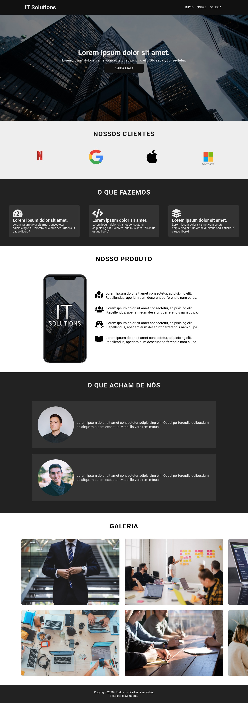
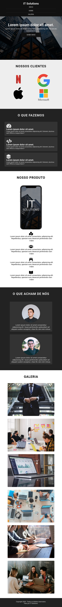

<h1 align="center">Site Responsivo :woman_technologist: </h1> 

    <a href="#pushpin-tecnologias">Tecnologias</a>&nbsp;|&nbsp;
    <a href="#pushpin-sobre">Sobre</a>&nbsp;|&nbsp;
    <a href="#pushpin-layout">Layout</a>&nbsp;
     
     

# :pushpin: Tecnologias
Página desenvolvida através das tecnologias:
- HTML5
- CSS3
- Flexbox
- Grid
- JavaScript
- JQuery

 

# :pushpin: Sobre
Página desenvolvida com base no vídeo <strong><a href="https://www.youtube.com/watch?v=G4_QjTJTVlc&ab_channel=FelipeRocha%E2%80%A2dicasparadevs" target="_blank">Fazendo um site TOTALMENTE RESPONSIVO e Mobile-Friendly - HTML & CSS</a></strong> do <a href="https://github.com/felipemotarocha" target="_blank">@felipemotarocha</a>.

 

# :pushpin: Layout

    <a href="#pushpin-desktop">Desktop</a>&nbsp;|&nbsp;
    <a href="#pushpin-mobile">Mobile</a>
     
     

## :pushpin: Desktop

    

 

## :pushpin: Mobile

    

Feito por <a href="https://github.com/juliarantess" target="_blank">juliarantess</a>.

